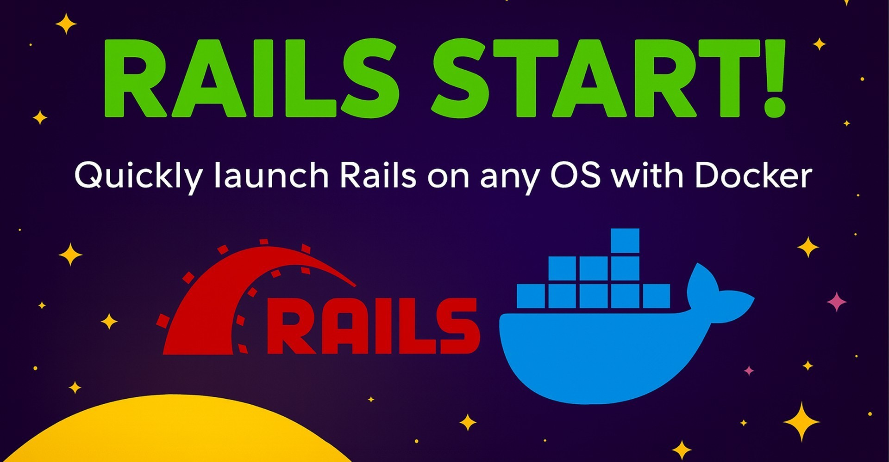

# Rails Start!

"Rails Start" is a starter kit for Ruby on Rails applications, designed to help developers quickly set up a new project with essential features and best practices.

This project is a perfect choice for:

- **Enterprises** looking to standardize their Rails application setup.
- **Freelancers and agencies** to kickstart client projects.
- **Online education platforms** to start teaching Ruby on Rails.
- **Individual developers** who want a solid foundation for their Rails applications.

## Requirements

- `Docker` and `Docker Compose` installed on your machine.
- `git` installed (usually comes pre-installed on MacOS and Linux).
- `make` utility installed (usually comes pre-installed on MacOS and Linux).
- `WSL2` (For Windows users) with a Linux distribution (like Ubuntu) is recommended.

## How to Use

<details>
<summary><strong>🪟 Windows Requirements (Click to expand)</strong></summary>

### Prerequisites for Windows Users

Before proceeding, Windows users need to set up WSL2:

1. **Install WSL2 and Ubuntu** (if not installed yet):

   Open `cmd` or `PowerShell` and run:

   ```powershell
   wsl --install
   wsl --set-default-version 2
   wsl --install -d Ubuntu
   ```

2. **Install make utility**:

   Run `WSL` and install `make`:

   ```bash
   wsl
   sudo apt-get install -y make
   ```

3. **Continue with the installation steps below** inside your WSL2 Ubuntu terminal.

</details>

### Installation Steps

1. Clone the repository:

   ```bash
   git clone https://github.com/the-teacher/rails-start.git
   ```

2. Navigate to the project directory:

   ```bash
   cd rails-start
   ```

3. Start the application:
   ```bash
   make rails-start
   ```

That's it! Very simple!

Now visit: `http://localhost:3000` in your browser.


## The Idea

This project uses power of `Docker` and `Makefiles` to automate the setup and management of a Rails application.

The `Makefile` commands abstract away the complexity of Docker commands, allowing developers to focus on coding rather than environment setup.

`make rails-start` command does everything needed to get you started.

# License

[MIT License. 2023-2025. Ilya N. Zykin](./LICENSE.md)
