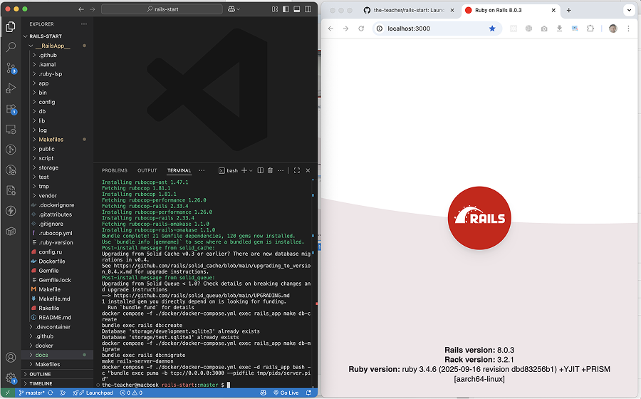
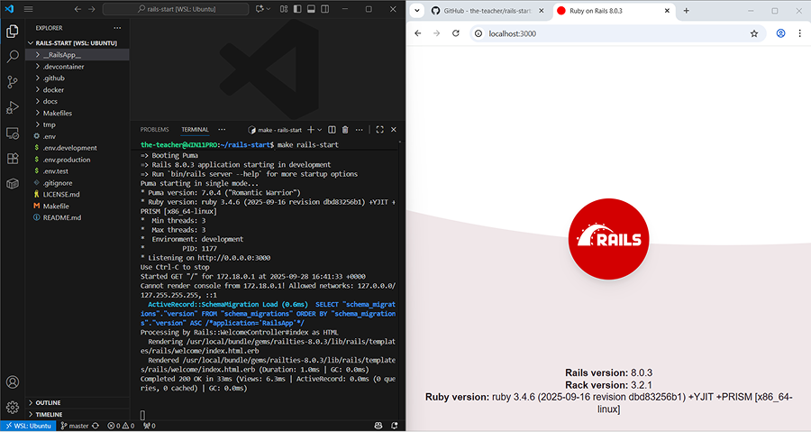

# Rails Start!

"Rails Start" is a starter kit for Ruby on Rails applications, designed to help developers quickly set up a new project with essential features and best practices.

This project is a perfect choice for:

- **Enterprises** looking to standardize their Rails application setup.
- **Freelancers and agencies** to kickstart client projects.
- **Online education platforms** to start teaching Ruby on Rails.
- **Individual developers** who want a solid foundation for their Rails applications.

## Requirements

- `Docker` and `Docker Compose` installed on your machine.
- `git` installed (usually comes pre-installed on MacOS and Linux).
- `make` utility installed (usually comes pre-installed on MacOS and Linux).
- `WSL2` (For Windows users) with a Linux distribution (like Ubuntu) is recommended.

## How to Use (MacOS / Linux)

- `git clone https://github.com/the-teacher/rails-start.git`
- `cd rails-start`
- `make rails-start`

That is it! Very simple!

Now visit: `http://localhost:3000` in your browser.



## How to Use (Windows WSL2)

- Open `cmd` or `PowerShell` and run:

Install WSL2 and Ubuntu (if not installed yet):

```powershell
wsl --install
wsl --set-default-version 2
wsl --install -d Ubuntu
```

Run `WSL` and install `make`:

```powershell
wsl
sudo apt-get install -y make
```

- `git clone https://github.com/the-teacher/rails-start.git`
- `cd rails-start`
- `make rails-start`

That is it! Very simple!

Now visit: `http://localhost:3000` in your browser.



## The Idea

This project uses power of `Docker` and `Makefiles` to automate the setup and management of a Rails application.

The `Makefile` commands abstract away the complexity of Docker commands, allowing developers to focus on coding rather than environment setup.

`make rails-start` command does everything needed to get you started.

## Project Status

Project is being remastered to support Rails 8.0 and Ruby 3.3.

- To use previous version use branch `rails7-startkit`.
- https://github.com/the-teacher/rails7-startkit/tree/RAILS_7_STARTKIT

# License

[MIT License. 2023-2025. Ilya N. Zykin](./LICENSE.md)
