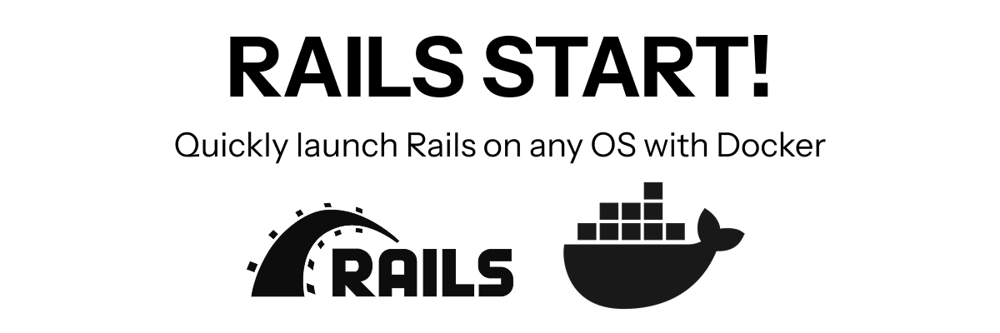

# Rails Start

"Rails Start" is a starter kit for Ruby on Rails applications, designed to help developers quickly set up a new project with essential features and best practices.

This project is a perfect choice for:

- For enterprises looking to standardize their Rails application setup.
- Freelancers and agencies to kickstart client projects.
- Online education platforms to start teaching Ruby on Rails.
- Individual developers who want a solid foundation for their Rails applications.

## Project Status

Project is being remastered to support Rails 8.0 and Ruby 3.3.

- To use previous version use branch `rails7-startkit`.
- https://github.com/the-teacher/rails7-startkit/tree/RAILS_7_STARTKIT

# License

[MIT License. 2023-2025. Ilya N. Zykin](./LICENSE.md)
